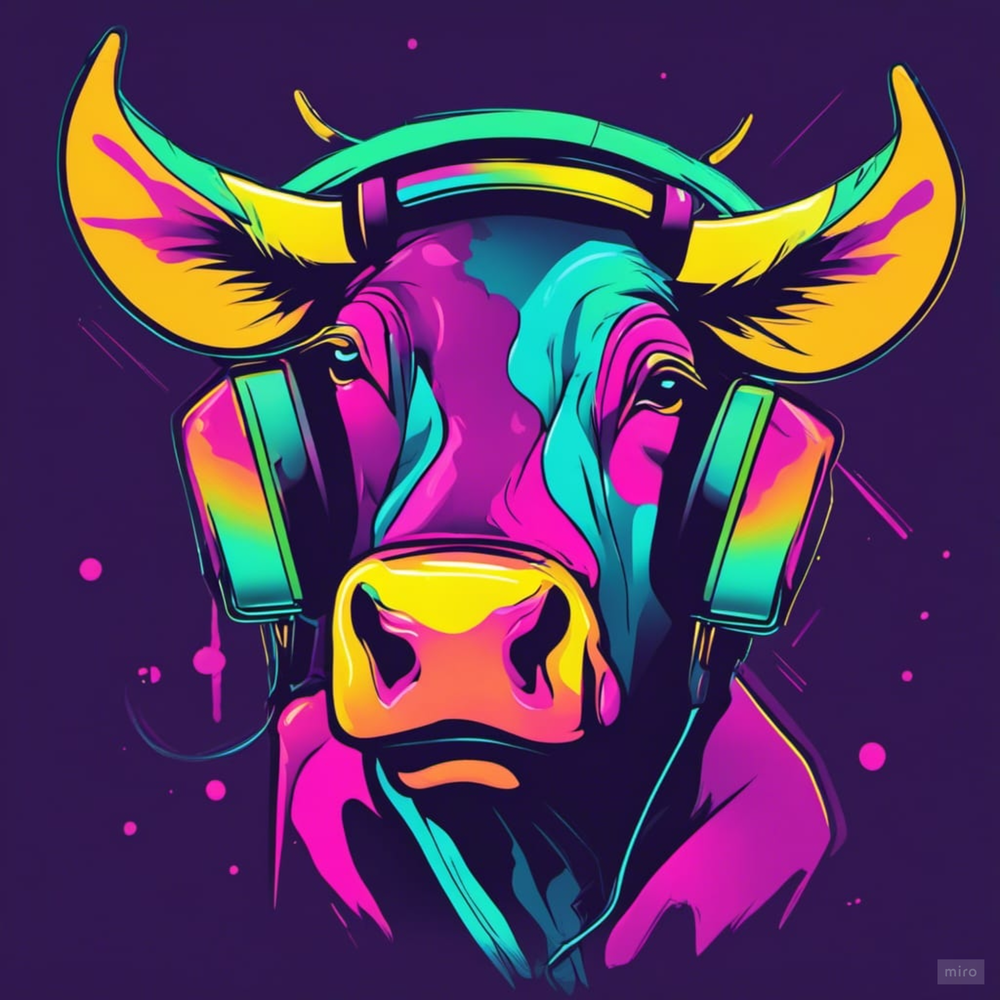

#  __Moosic : Business Brief__

##  __Business goal, value, requirements and solutions__

---

###  __Business Goal/Objective__

 

> __Goal : to build a web app with a mood filter where users can get the top 10 songs or artists to based on their mood (they input the mood of the moment) and also based on their preferences (audio features can be like optional filters in addition).__

 

###  __Business Value__

 

> __Value__: why? as maybe a pseudo startup? Customer satisfaction which we can monitor based on how many users the data product (customer churn ) for maybe other potential stakeholders like spotify & other streaming services, could also increase sales (subscription to the platform) and also increase use of service

 

###  __Stakeholders__

 

* > Moosic : Mood and Music
* > Streaming Platforms
* > Team : Data Practitioners

 

###  __Data__

 

* > Spotify 600k track dataset 
* > Emotion labelled spotify songs
* > ...

 

###  __Data end products / solution__

 

* > Model : Recommender System based on mood & audio feature filtering 
* > ML model : Top N ...  prediction model 
* > Web app product
* > Visuals / EDA Dashboards to show analysis from business context (kpis, metrics etc?)

 

###  __Future Work & Additions__

 

* > AB-Testing
* > Automated end-to-end data pipeline
* > Production grade moosic data product

 

---

